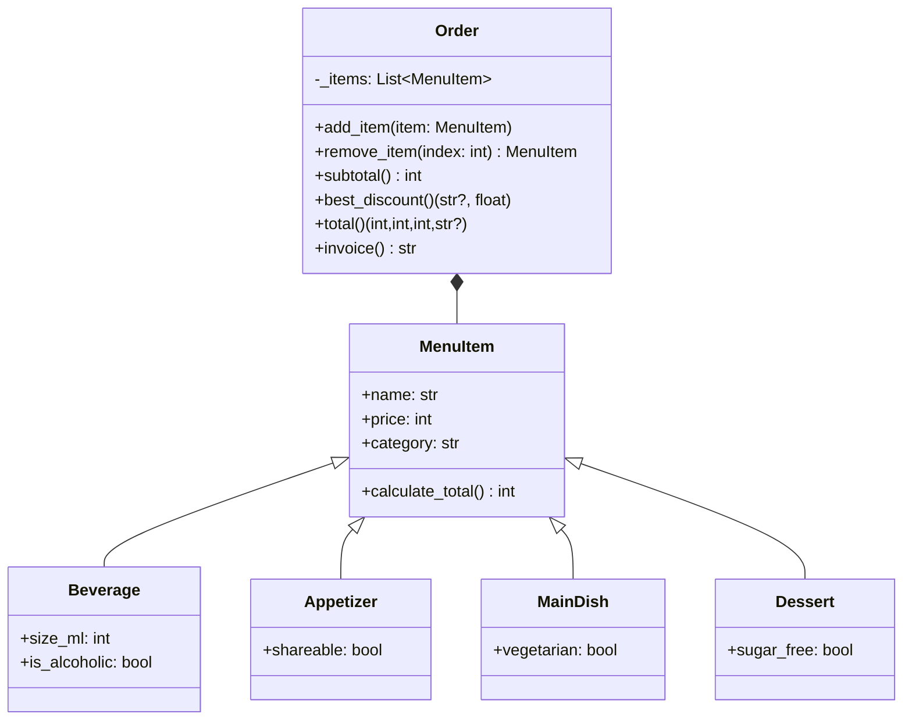

# Reto-3

1.Escenario de restaurante: desea diseñar un programa para calcular la factura del pedido de un cliente en un restaurante.

-Definir una clase base MenuItem: Esta clase debe tener atributos como nombre, precio y un método para calcular el precio total.

-Cree subclases para diferentes tipos de elementos de menú: herede de MenuItem y defina propiedades específicas para cada tipo (por ejemplo, Bebida, Aperitivo, Plato principal).

-Definir una clase Order: Esta clase debe tener una lista de objetos MenuItem y métodos para agregar artículos, calcular el monto total de la factura y potencialmente aplicar descuentos específicos según la composición del pedido.

Cree un diagrama de clases con todas las clases y sus relaciones. El menú debe tener al menos 10 elementos. El código debe seguir las reglas PEP8.

#Diagrama UML


# Codigo :

```

from __future__ import annotations
from dataclasses import dataclass
from typing import Dict, Iterable, List, Tuple


@dataclass(frozen=True)
class MenuItem:
    name: str
    price: int

    @property
    def category(self) -> str:
        return "General"

    def calculate_total(self) -> int:
        return self.price

    def __str__(self) -> str:
        return f"{self.name} ({self.category}) — ${self.calculate_total():,}".replace(",", ".")


@dataclass(frozen=True)
class Beverage(MenuItem):
    size_ml: int = 350
    is_alcoholic: bool = False

    @property
    def category(self) -> str:
        return "Bebida"


@dataclass(frozen=True)
class Appetizer(MenuItem):
    shareable: bool = True

    @property
    def category(self) -> str:
        return "Aperitivo"


@dataclass(frozen=True)
class MainDish(MenuItem):
    vegetarian: bool = False

    @property
    def category(self) -> str:
        return "Plato principal"


@dataclass(frozen=True)
class Dessert(MenuItem):
    sugar_free: bool = False

    @property
    def category(self) -> str:
        return "Postre"


class Order:
    def __init__(self, items: Iterable[MenuItem] | None = None) -> None:
        self._items: List[MenuItem] = list(items) if items else []

    def add_item(self, item: MenuItem) -> None:
        self._items.append(item)

    def remove_item(self, index: int) -> MenuItem:
        return self._items.pop(index)

    def clear(self) -> None:
        self._items.clear()

    @property
    def items(self) -> Tuple[MenuItem, ...]:
        return tuple(self._items)

    def subtotal(self) -> int:
        return sum(i.calculate_total() for i in self._items)

    def _category_counts(self) -> Dict[str, int]:
        counts: Dict[str, int] = {}
        for i in self._items:
            counts[i.category] = counts.get(i.category, 0) + 1
        return counts

    def _eligible_discounts(self) -> Dict[str, float]:
        counts = self._category_counts()
        sub = self.subtotal()
        discounts: Dict[str, float] = {}
        if counts.get("Plato principal", 0) >= 3:
            discounts["Promo 3+ principales"] = 0.10
        if (
            counts.get("Plato principal", 0) >= 1
            and counts.get("Bebida", 0) >= 1
            and counts.get("Postre", 0) >= 1
        ):
            discounts["Combo principal+bebida+postre"] = 0.12
        if sub >= 120_000:
            discounts["Subtotal ≥ $120.000"] = 0.08
        return discounts

    def best_discount(self) -> Tuple[str | None, float]:
        discounts = self._eligible_discounts()
        if not discounts:
            return None, 0.0
        name = max(discounts, key=discounts.get)
        return name, discounts[name]

    def total(self) -> Tuple[int, int, int, str | None]:
        sub = self.subtotal()
        label, frac = self.best_discount()
        discount_value = int(round(sub * frac))
        total_value = sub - discount_value
        return sub, discount_value, total_value, label

    def invoice(self) -> str:
        lines = ["FACTURA", "-" * 40]
        for idx, it in enumerate(self._items, start=1):
            lines.append(
                f"{idx:>2}. {it.name:30} ${it.calculate_total():>8,}".replace(",", ".")
            )
        lines.append("-" * 40)
        sub, disc, tot, label = self.total()
        lines.append(f"Subtotal:                 ${sub:>8,}".replace(",", "."))
        if disc > 0:
            tag = f" ({label})" if label else ""
            lines.append(f"Descuento{tag}:           -${disc:>8,}".replace(",", "."))
        lines.append(f"TOTAL:                    ${tot:>8,}".replace(",", "."))
        return "\n".join(lines)


MENU: Dict[str, MenuItem] = {
    "papas_bravas": Appetizer("Papas bravas", 16_000),
    "nachos": Appetizer("Nachos con queso", 22_000, shareable=True),
    "ensalada": Appetizer("Ensalada verde", 18_000, shareable=False),
    "hamburguesa": MainDish("Hamburguesa clásica", 32_000),
    "lasaña": MainDish("Lasaña boloñesa", 36_000),
    "bowl_veg": MainDish("Buddha bowl", 34_000, vegetarian=True),
    "parrilla": MainDish("Parrilla mixta", 58_000),
    "limonada": Beverage("Limonada", 9_000, size_ml=400),
    "coca cola": Beverage("Gaseosa", 7_000, size_ml=350),
    "cerveza": Beverage("Cerveza artesanal", 15_000, size_ml=330, is_alcoholic=True),
    "brownie": Dessert("Brownie con helado", 17_000),
    "flan_sf": Dessert("Flan sin azúcar", 16_000, sugar_free=True),
}


def _demo() -> None:
    order = Order()
    order.add_item(MENU["papas_bravas"])
    order.add_item(MENU["hamburguesa"])
    order.add_item(MENU["limonada"])
    order.add_item(MENU["brownie"])

    print("Menú de ejemplo (≥10 ítems):")
    for key, item in MENU.items():
        print(f"- {key:12} -> {item}")
    print("\n" + order.invoice())


if __name__ == "__main__":
    _demo()


```
#

En este reto se modela un restaurante aplicando herencia y composición en POO: la clase base MenuItem define los atributos name y price y un método calculate_total() para calcular el precio del ítem, mientras que las subclases Beverage, Appetizer, MainDish y Dessert heredan de ella y agregan características específicas (tamaño y si es alcohólica en bebidas, si es compartible en aperitivos, si es vegetariano en platos principales o sin azúcar en postres); la clase Order compone una lista de objetos MenuItem, permite agregar o eliminar artículos, calcular el subtotal, aplicar descuentos (10% si hay 3 o más platos principales, 12% si se pide combo principal+bebida+postre, o 8% si el subtotal supera $120.000) y generar una factura en formato de texto; se incluye un menú de ejemplo con más de 10 elementos distintos que cumple con el requisito mínimo.
